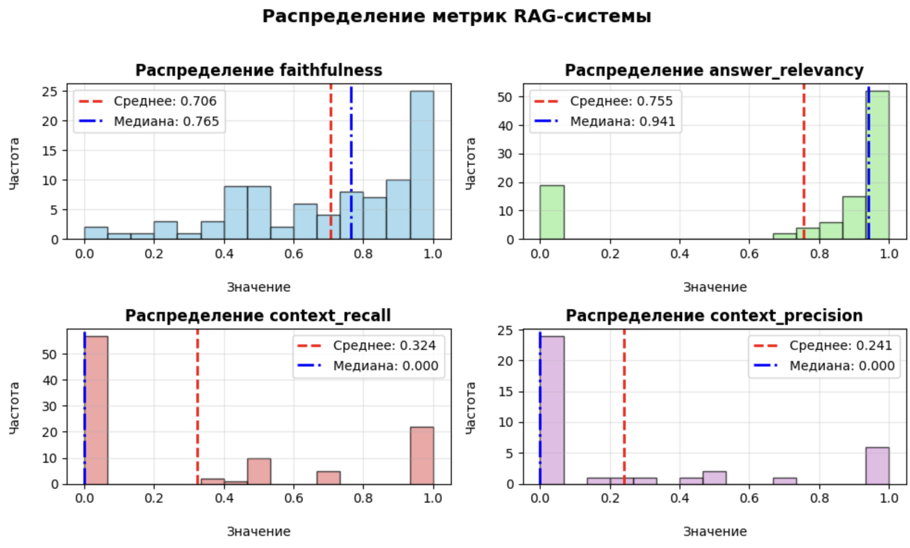
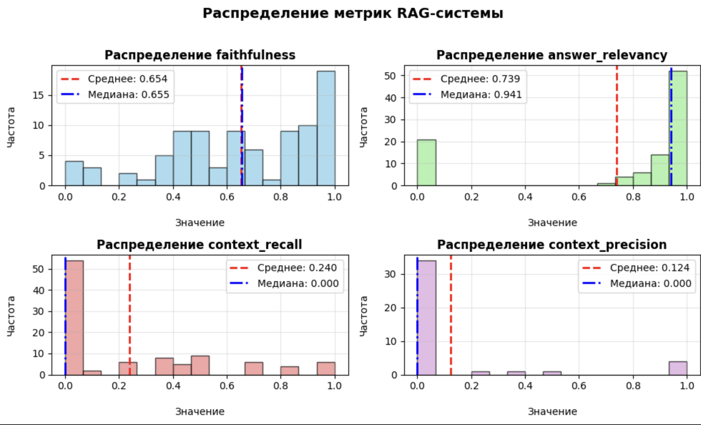

## **Оценка результатов работы RAG с помощью фрейморка RAGAS**


### 1. Подготовка валидационных датасетов

Для оценки результатов работы RAG были подготовлены два валидационных датасета по 100 вопросов с эталонным ответами (ground_truth):

* с помошью модели **Haiku 4.5**, более простые ответы (файл 'tourism_travel_questions_with_ground_truth_ver_short.csv')
* с помошью модели **Sonnet 4.5**, более развернутые и сложные ответы (файл  'tourism_travel_questions_with_ground_truth_ver_long.csv')

Структура датасетов: 

| question | difficulty_level | question_type | topic | ground_truth |
|---|---|---|---|---|
| What documents do I need to travel internationally?  | easy | factual | safety | For international travel, you typically need a... |

**question** - запрос для RAG \
**difficulty_level** - сложность вопроса (easy / hard / medium / off-topic) \
**question_type** - тип вопроса (comparative / factual / procedural / recommendation) \
**topic** - тема запроса (attractions / career / cooking / culture / etc) \
**ground_truth** - эталонный ответ, сгенерированный более "умной" llm

### 2. Доработка функциоонала RAG для возможности оценки

* в файл запуска ```team-repo/main.py``` добавлена возможность передачи аргумента ```--save``` для сохранения в формате jsonl:
<pre>   {
    "query": текст запроса, 
    "clarified_query" : уточненный RAGом запрос, 
    "answer": ответ RAG, 
    "contexts": использованные чанки из БЗ, 
    "retrieved_k": "количество использованных чанков" 
    } </pre>

* функция ```evaluation/getting_answers.py``` получает на вход csv c валидационным датасетом и передает запросы в ```team-repo/main.py``` для запуска RAG

### 3. Оценивание с помощью RAGAS

**Формат датасета для оценки:**

| Ключ | Значение (сокращённое) |
| :--- | :--- |
| **question** | `"What documents do I need to travel internationally?"` |
| **answer** | `"Based on the provided context, here are the documents you may need to travel internationally:\n\n1. **Passport**: A valid passport is essential...\n\n2. **Visa or Permit**: Depending on your destination...\n\n3. **Travel Insurance**: It's recommended...\n\n4. **Customs Forms**: Some countries require...\n\n5. **Medication Documentation**: If you're carrying...\n\n6. **Financial Documents**: For short-term visas...\n\n7. **Employment or School Certificates**: These might be...\n\n8. **Specialized Identity Cards or Trust..."` |
| **contexts** | `Список из 5 текстовых чанков. Пример первого: "customs. Also, do get a Travel insurance which also covers medical evacuation. Take two copies of important documents you will bring with you..."` |
| **ground_truth** | `"For international travel, you typically need a valid passport. Some countries also require visas. EU citizens can travel within the European Union with just a government-issued ID card..."` |

**Оцениваемые метрики:**

- **Faithfulness (Верность контексту)**: Насколько ответ основан на предоставленном контексте. Борется с "галлюцинациями".
    
- **Answer Relevance (Релевантность ответа)**: Насколько ответ прямо соответствует вопросу.
    
- **Context Relevance (Релевантность контекста)**: Насколько извлеченные контексты релевантны вопросу.
    
- **Context Recall (Полнота контекста)**: _Требует ground truth_. Насколько все ключевые факты из эталонного ответа присутствуют в контексте.


**Использованные модели для оценки (llm as a judge):**

- **GPT-4o** для оценки ответов RAG, сравнения с эталоном, анализ используемого контекста (чанки). Модель была выбрана, так как она значительно "умнее" модели генерации RAG (mistral-small), а также с ней относительно удобно работать с RAGAS (через клиент ChatOpenAI и LangchainLLMWrapper). Кроме того, модель относительно недорогая в использовании.
- **text-embedding-3-small** - для вычисления семантического сходства между вопросами, ответами и контекстами. Это нужно для вычисления

    * **Context Relevance:** Насколько найденные чанки (contexts) релевантны вопросу. Сравниваются эмбеддинги вопроса и каждого чанка.

    * **Answer Relevancy:** Насколько ответ соответствует вопросу. Анализируется сходство между эмбеддингами вопроса и сгенерированного ответа.

### 4. Результаты оценки и выводы 

**Датасет Haiku**

***Описательная статистика***

|       |   faithfulness |   answer_relevancy |   context_recall |   context_precision |
|:------|---------------:|-------------------:|-----------------:|--------------------:|
| mean  |       0.706013 |           0.755125 |         0.324006 |            0.240878 |
| std   |       0.269825 |           0.378017 |         0.420132 |            0.381173 |
| min   |       0        |           0        |         0        |            0        |
| 25%   |       0.5      |           0.784734 |         0        |            0        |
| 50%   |       0.764706 |           0.941341 |         0        |            0        |
| 75%   |       0.97619  |           0.987292 |         0.666667 |            0.45     |
| max   |       1        |           1        |         1        |            1        

Как можно заметить, основная слабое место RAG-системы — ретривер. Низкие значения context_recall (0.32) и context_precision (0.24) означают, что он находит мало релевантной информации и часто пропускает ключевые данные. Это напрямую ограничивает качество генерации, о чём говорят средние значения faithfulness (0.71) и answer_relevancy (0.76): модель даёт релевантные, но не всегда фактологически точные ответы, так как ей не хватает качественного контекста.

***Графики распределения метрик***



1. **Faithfulness (точность)**
Распределение смещено вправо (среднее 0.71, медиана 0.77) — большинство ответов хорошо соответствуют контексту. Есть небольшой хвост низких значений, указывающий на редкие случаи галлюцинаций модели.
2. **Answer Relevancy (релевантность ответа)**
Бимодальное распределение с двумя пиками: около 0 и около 1.0 (медиана 0.94). Большинство ответов либо очень релевантны вопросу, либо совсем нерелевантны — промежуточных значений мало.
3. **Context Recall (полнота контекста)**
Критическая проблема: более половины значений равны 0 (медиана 0.0, среднее 0.32). Это означает, что в большинстве случаев извлеченный контекст не содержит информацию из ground_truth — RAG плохо находит релевантные документы.
4. **Context Precision (точность контекста)**
Аналогичная проблема: большинство значений = 0 (медиана 0.0, среднее 0.24). Релевантные фрагменты контекста не попадают в топ результатов поиска — нужно улучшать retrieval (индексацию, эмбеддинги, ранжирование).

**Если убрать из оценки off-topic вопросы**

| Метрика             | faithfulness | answer_relevancy | context_recall | context_precision |
|---------------------|--------------|------------------|----------------|-------------------|
| mean                | 0.730132     | 0.870221         | 0.367857       | 0.297083          |
| std                 | 0.254315     | 0.256656         | 0.425495       | 0.403845          |
| min                 | 0.000000     | 0.000000         | 0.000000       | 0.000000          |
| 25%                 | 0.533422     | 0.885604         | 0.000000       | 0.000000          |
| 50%                 | 0.777778     | 0.962205         | 0.000000       | 0.000000          |
| 75%                 | 0.949580     | 0.989812         | 0.750000       | 0.500000          |
| max                 | 1.000000     | 1.000000         | 1.000000       | 1.000000  

**График распределения бещ off-topic вопросов**


1. **Faithfulness (точность)**
Улучшилась незначительно: среднее 0.73 (+0.024), медиана 0.78 (+0.013). Распределение осталось правосмещенным — большинство ответов точно следуют контексту.
2. **Answer Relevancy (релевантность ответа)**
Заметное улучшение: среднее 0.87 (+0.115), медиана 0.96 (+0.021). Убрав off-topic вопросы, почти исчез левый пик (нерелевантные ответы) — теперь большинство ответов релевантны.
3. **Context Recall (полнота контекста)**
Минимальное улучшение: среднее 0.37 (+0.044), но медиана всё ещё 0.0. Проблема retrieval частично сохраняется, хотя появилось чуть больше ненулевых значений.
4. **Context Precision (точность контекста)**
Аналогично: среднее 0.30 (+0.056), медиана 0.0. Улучшение минимальное — большинство запросов всё ещё не находят релевантные документы в топе выдачи.

**Датасет Sonnet**

***Описательная статистика***

| Метрика             | faithfulness | answer_relevancy | context_recall | context_precision |
|---------------------|--------------|------------------|----------------|-------------------|
| mean                | 0.653932     | 0.739180         | 0.240155       | 0.123984          |
| std                 | 0.287803     | 0.392746         | 0.314666       | 0.307951          |
| min                 | 0.000000     | 0.000000         | 0.000000       | 0.000000          |
| 25%                 | 0.454545     | 0.776811         | 0.000000       | 0.000000          |
| 50%                 | 0.654762     | 0.941341         | 0.000000       | 0.000000          |
| 75%                 | 0.912500     | 0.989173         | 0.446429       | 0.000000          |
| max                 | 1.000000     | 1.000000         | 1.000000       | 1.000000          |

Сравнение с предыдущими результатами:

В сравнении с прошлой оценкой (faithfulness: 0.73, answer_relevancy: 0.87) текущие результаты показывают заметное снижение по всем ключевым метрикам в сравнении с результатами haiku без off-topic запросов:

**Faithfulness** и **Answer Relevancy** упали на 0.07-0.13 пункта, что указывает на общее снижение качества и стабильности генерации ответов.

Показатели ретривера (**Context Recall** и **Precision**) ухудшились критически:

- **Context Recall** снизился с 0.37 до 0.24.

- **Context Precision** уменьшился более чем в два раза — с 0.30 до 0.12.

Медиана (50%) для context_precision теперь равна 0 даже в 75-м процентиле (ранее было 0.5).

***Графики распределения метрик***


1. Faithfulness (точность)
Сильное ухудшение: среднее 0.65 (-0.08), медиана 0.66 (-0.12). Распределение стало более равномерным с центром около 0.6-0.7 — модель чаще галлюцинирует или неточно следует контексту.
2. Answer Relevancy (релевантность ответа)
Деградация: среднее 0.74 (-0.13), медиана осталась 0.94. Вернулся значительный пик около нуля (~20 случаев) — появилось много нерелевантных ответов, которых не было в предыдущей версии.
3. Context Recall (полнота контекста)
Критическое ухудшение: среднее 0.24 (-0.13), медиана 0.0. Более половины значений = 0, распределение сместилось влево — retrieval работает хуже, чем раньше.
4. Context Precision (точность контекста)
Критическое ухудшение: среднее 0.12 (-0.18), медиана 0.0. Почти все значения (>80%) равны нулю — система практически не находит релевантные документы в принципе.

**Если убрать из оценки off-topic вопросы**

| Метрика             | faithfulness | answer_relevancy | context_recall | context_precision |
|---------------------|--------------|------------------|----------------|-------------------|
| mean                | 0.674244     | 0.850890         | 0.265247       | 0.158854          |
| std                 | 0.268780     | 0.289931         | 0.307039       | 0.341538          |
| min                 | 0.000000     | 0.000000         | 0.000000       | 0.000000          |
| 25%                 | 0.473684     | 0.885589         | 0.000000       | 0.000000          |
| 50%                 | 0.666667     | 0.962225         | 0.200000       | 0.000000          |
| 75%                 | 0.900000     | 0.990583         | 0.500000       | 0.000000          |
| max                 | 1.000000     | 1.000000         | 1.000000       | 1.000000     

***Графики распределения метрик***


1. Faithfulness (точность)
Небольшое улучшение: среднее 0.67 (+0.02), медиана 0.67 (+0.01). Распределение всё ещё широкое с центром на 0.6-0.7, но больше значений сместилось к высоким оценкам (>0.8).
2. Answer Relevancy (релевантность ответа)
Значительное улучшение: среднее 0.85 (+0.11), медиана 0.96 (+0.02). Левый пик (нерелевантные ответы) уменьшился с ~20 до ~8 случаев — большинство ответов теперь высокорелевантны.
3. Context Recall (полнота контекста)
Заметное улучшение: среднее 0.27 (+0.03), медиана 0.20 (было 0.0!) Впервые медиана не нулевая — появилось больше запросов, где retrieval находит правильный контекст.
4. Context Precision (точность контекста)
Небольшое улучшение: среднее 0.16 (+0.04), медиана всё ещё 0.0. Проблема retrieval частично решена, но большинство запросов (~75%) всё равно не находят релевантные документы в топе.

Таким образом, в дальнейшем итерации работы над RAG стоит уделить внимание улучшению работы ретривера.