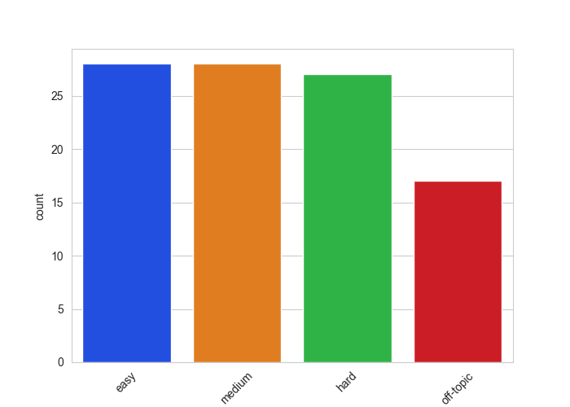

# Отчет №2 по работе над командным проектом по LLM

## Сведения о проекте

**Тема проекта:** AI-гид

**Ментор:** Василий Самарин

**Команда:** DreamTeamHouse

**Участники команды:**
- Лукоянова Василиса
- Лившиц Лев
- Миллер Алина
- Попов Владимир
- Михайлов Владислав

**Репозиторий проекта**

Мы ведем командную работу в двух репозиториях:

research & development – репозиторий, посвященный исследованию предметной области, доступных данных, рынка и технологий, технологический решений

код для RAG-системы тоже содержится здесь
https://github.com/exxyyf/ai-adventure-guide-dth

prod – репозиторий, содержащий код актуального решения для деплоя тг-бота и запуска на виртуальной машине
https://github.com/Levliv/AI-travel-guide

# Архитектура пайплайна

todo

# Взаимодействие компонентов

todo

# Результаты тестирования

Мы тестировали несколько аспектов нашего решения:

1. RAG-система, ответы по текстовым вопросам
2. Системы для ответа по фотографиям, чтобы выбрать лучшую
	1. Image Captioning с помощью API Pixtral
	2. Мультимодальный RAG с помощью SigLip

## Тестирование RAG-системы

todo

### Описание валидационной выборки

Для создания валидационной выборки мы сгенерировали 100 вопросов разного уровня сложности, опираясь на наш датасет, и добавили к ним ground truth с помощью Claude Sonnet 4.5 (ver_long) и Haiku 4.5 (ver_short). В выборку мы включили также off-topic вопросы, на которые система должна отвечать, что запрос нерелевантен теме туризма и путешествий.

EDA для валидационной выборки [здесь](https://github.com/exxyyf/ai-adventure-guide-dth/blob/main/baselines/validation_data_eda.ipynb)

### Описание пайплайна тестирования

todo

### Итоговые метрики

todo

## Тестирование определения достопримечательности по фото

Мы хотим предоставить пользователю возможность отправлять в систему запрос не только текстом, но и изображением.

Здесь ссылка на [технологический обзор](https://github.com/exxyyf/ai-adventure-guide-dth/blob/main/baselines/image_as_an_input_report.md) и [реализацию](https://github.com/exxyyf/ai-adventure-guide-dth/tree/main/baselines) двух бейслайн решений

Задачей тестирования было выбрать 1 из 2 решений для дальнейшего встраивания в проект.

Виды тестирования:

- оценка качества корректного распознавания достопримечательности
- скорость ответа

## Тестирование качества распознавания

Мы создали валидационную выборку из 20 изображений, 10 из которых относятся к широко известным достопримечательностям, а остальные 10 - к малоизвестным.

В случае 1 сценария, Pixtral дает текстовое описание картинки
В случае 2 сценария, по расстоянию между эмбеддингами картинки и текстов (сделанных SigLip), определяются чанки датасета с подходящей информацией

Суть оценки качества распознавания - это оценить:
- в 1 случае - правильно ли модель описывает достопримечательность
- во 2 случае - находится ли по созданным эмбеддингам подходящая статья из датасета, содержащая информацию про достопримечательность

## Тестирование скорости ответа
