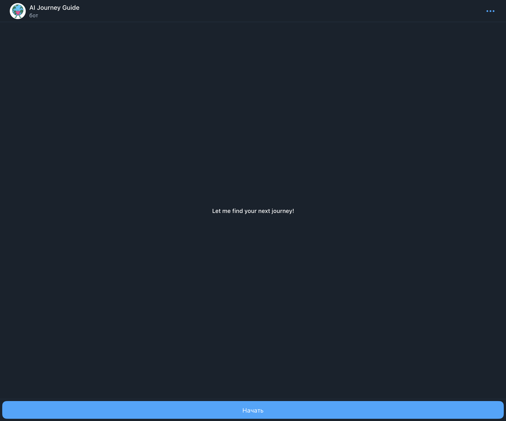
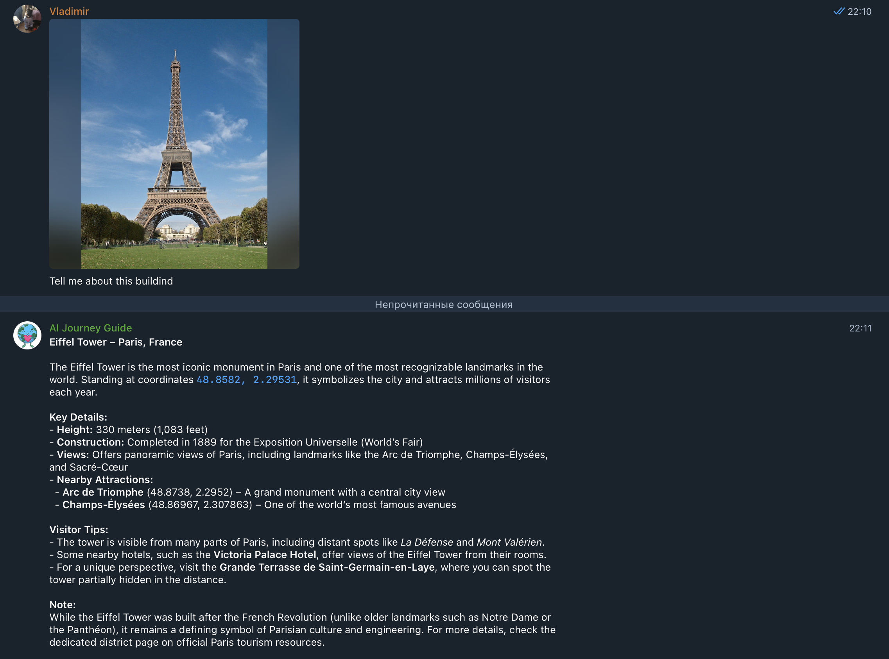

# Отчет №3 по работе над командным проектом по LLM
---
**Чекпоинт 3**: Деплой и интерфейс
## Сведения о проекте

**Тема проекта:** AI-гид

**Ментор:** Василий Лаврентьев

**Команда:** DreamTeamHouse

**Участники команды:**
- Лукоянова Василиса
- Лившиц Лев
- Миллер Алина
- Попов Владимир
- Михайлов Владислав

**Репозиторий проекта**

Мы ведем командную работу в git-репозитории:
https://github.com/exxyyf/ai-adventure-guide-dth

Он содержит исследование предметной области, доступных данных, рынка и технологий, технологический решений, тестирование решения и код для развертывания RAG-системы.
# Функционал интерфейса

## Выбор интерфейса

В качестве интерфейса для общения с нашим AI-гидом был выбран **Telegram-bot**.

Причины:
- Telegram есть под рукой у более чем миллиарда пользователей;
- взаимодействие с Telegram-bot'ами привычно людям;
- это просто для пользователей и нашей разработки (такой выбор позволил нам уделить больше внимания архитектуре RAG, его оценке и дополнительным фичам).

Найти наш бот на просторах Telegram можно под ником `@ai_journey_guide_bot` или по ссылке: https://t.me/ai_journey_guide_bot

## Взаимодействие с интерфейсом

При входе пользователь увидит call-to-action надпись и кнопку:



После нажатия на кнопку "Начать", пользователь увидит приветственное сообщение и примеры использования бота:


Пользователю AI-гида доступны:
- **текстовые запросы** о путешествиях по миру;
- поиск достопримечательностей **по фото**;
- **текстовые запросы** с прикреплением **фото** достопримечательностей.

Фотография достопримечательности прикрепляется к запросу в интерфейсе Telegram с помощью кнопки .

Гид общается на **английском языке**.
## Примеры использования

Несколько примеров диалогов:




---
# Инструкция по запуску
## 🛠️ Требования для локального запуска

- Docker (рекомендуется версия 24+)
- Docker Compose (рекомендуется версия 2+; встроен в Docker Desktop на Windows/macOS)

## 🚀 1. Запуск проекта

Клонировать репозиторий:

```bash
git clone https://github.com/exxyyf/ai-adventure-guide-dth
cd ai_guide
```

## 🔑 2. Настройка ключей

Создайте файл .env в ai_guide по образцу .env.example:

```
# .env.example
MISTRAL_API_KEY=your_api_key_here
HF_TOKEN=your_api_key_here
TELEGRAM_BOT_TOKEN=your_api_key_here
RAG_PORT=8001
DATA_DIR=/app/data
API_URL=http://rag-app:8001/answer
```

##  📥 2. Скачать данные

1. Скачайте архив data/ с Google Drive:
<https://drive.google.com/file/d/1o9sy59wAFY2utvUHcCxLMOJaSIxFqkQd/view?usp=sharing>

2. Распакуйте в ai_guide проекта:

```text
ai_guide/
  data/
    chunked_texts.pkl
    embeddings.npy
    metadata.json
    wikivoyage.index
```

## ▶️ 4. Запуск сервиса


### 🐳 1. Поднять контейнеры локально
```
docker compose up -d --build
```
### 🤖 2. Зайти в телеграм бот @ai_journey_guide_bot
Нажать кнопку ```Start```, дождаться ответа от бота и задать свой вопрос. 

При желании протестировать решение **без локального развертывания**, мы поднимем виртуальный сервер. Для этого необходимо написать [Василисе](https://telegram.me/exxyyf) в Telegram (`@exxyyf`).


### ⚠️ 3. Как отключить сервиc 
Остановить контейнеры
```docker compose down```

Более подробную инструкцию можно найти в главном `README` репозитория:
https://github.com/exxyyf/ai-adventure-guide-dth
---
# Финальные метрики качества

В прошлой итерации мы тестировали несколько аспектов нашего решения:
1. RAG-система, ответы по текстовым вопросам
2. Системы для ответа по фотографиям, чтобы выбрать лучшую
	1. Image Captioning с помощью API Pixtral (**победило по качеству**)
	2. Мультимодальный RAG с помощью SigLip

В рамках текущей итерации была реализована интеграция с API Pixtral, а также была проведена работа с промптами RAG-пайплайна, поэтому мы повторно тестировали именно RAG с помощью RAGAS.

Постфактум, в первом тестировании были обнаружены ошибки, которые не позволили посчитать метрики на полном тестовом наборе (по части примеров рассчитывались не все метрики), что ставило под сомнение объективность метрик. Мы устранили проблему следующим образом:
- усовершенствовали пайплайн тестирования;
- провели тест бейслайна повторно, на полном тестовом наборе;
- протестировали RAG с улучшенными промптами.
## Описание валидационной выборки

Для создания валидационной выборки мы сгенерировали 100 вопросов разного уровня сложности, опираясь на наш датасет, и добавили к ним ground truth с помощью Claude Haiku 4.5. В выборку мы включили также off-topic вопросы, на которые система должна отвечать, что запрос нерелевантен теме туризма и путешествий.

## Оцениваемые метрики

- **Faithfulness (Верность контексту)**: Насколько ответ основан на предоставленном контексте. Борется с "галлюцинациями".
    
- **Answer Relevance (Релевантность ответа)**: Насколько ответ прямо соответствует вопросу.
    
- **Context Relevance (Релевантность контекста)**: Насколько извлеченные контексты релевантны вопросу.
    
- **Context Recall (Полнота контекста)**: _Требует ground truth_. Насколько все ключевые факты из эталонного ответа присутствуют в контексте.

## Результаты

Метрики до изменения промптов:

| Метрика | faithfulness | answer_relevancy | context_recall | context_precision |
| ------- | ------------ | ---------------- | -------------- | ----------------- |
| count   | 83.000000    | 83.000000        | 83.000000      | 83.000000         |
| mean    | 0.695021     | 0.864325         | 0.358979       | 0.212015          |
| std     | 0.269441     | 0.270763         | 0.418088       | 0.344386          |
| min     | 0.000000     | 0.000000         | 0.000000       | 0.000000          |
| 25%     | 0.500000     | 0.892428         | 0.000000       | 0.000000          |
| 50%     | 0.777778     | 0.962226         | 0.000000       | 0.000000          |
| 75%     | 0.919872     | 0.989798         | 0.666667       | 0.375000          |
| max     | 1.000000     | 1.000000         | 1.000000       | 1.000000          |
Метрики после изменения промптов:

| Метрика | faithfulness | answer_relevancy | context_recall | context_precision |
| ------- | ------------ | ---------------- | -------------- | ----------------- |
| count   | 83.000000    | 83.000000        | 83.000000      | 83.000000         |
| mean    | 0.662608     | 0.886806         | 0.384710       | 0.250937          |
| std     | 0.277898     | 0.159103         | 0.417264       | 0.368218          |
| min     | 0.000000     | 0.000000         | 0.000000       | 0.000000          |
| 25%     | 0.506757     | 0.865977         | 0.000000       | 0.000000          |
| 50%     | 0.733333     | 0.918869         | 0.333333       | 0.000000          |
| 75%     | 0.892720     | 0.967265         | 0.875000       | 0.500000          |
| max     | 1.000000     | 1.000000         | 1.000000       | 1.000000          |
Мы видим улучшение метрик `answer_relevancy`, `context_recall`, `context_precision` после изменения промптов,
однако получили небольшой спад достоверности (`faithfulness`).
## Вывод по тестированию новых промптов
### Положительные изменения

1. Стабильность качества - резко снизился разброс в answer_relevancy
2. Лучший retrieval - улучшение обеих метрик контекста
3. Сдвиг медианы context_recall с 0 к 0.333 показывает, что проблемные кейсы стали отрабатывать лучше
### Отрицательные изменения

1. Система стала больше выдумывать

Тестирование показало, что стоит сохранить новые промпты для retrieval-части (так как они улучшили извлечение контекста), но в качестве зоны роста можно рассматривать промпты для генерации ответов.